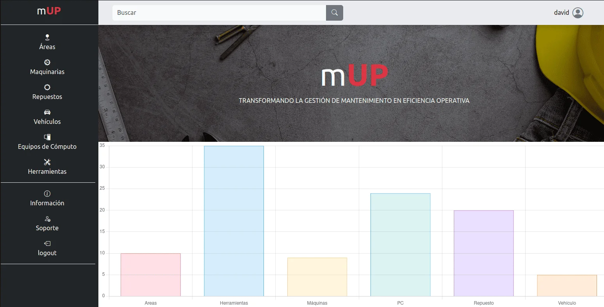
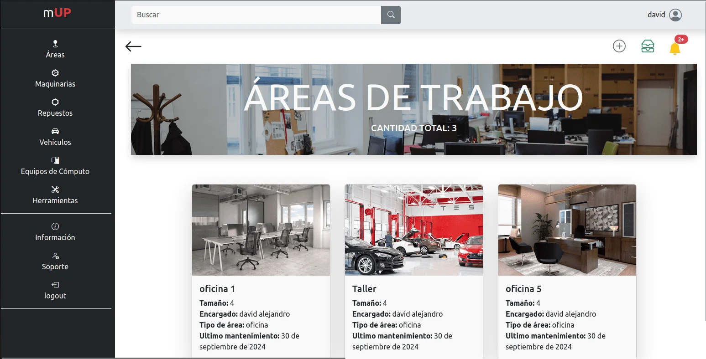
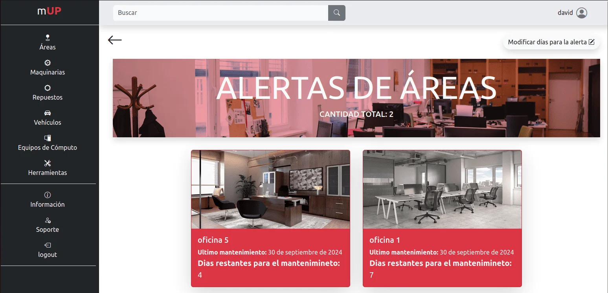
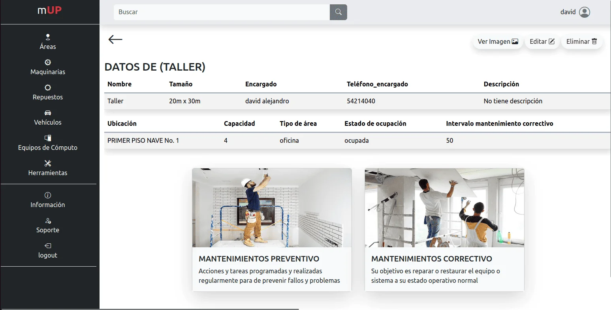
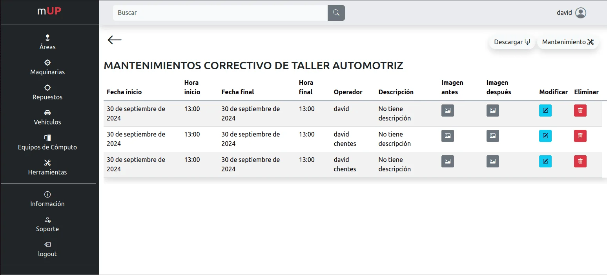
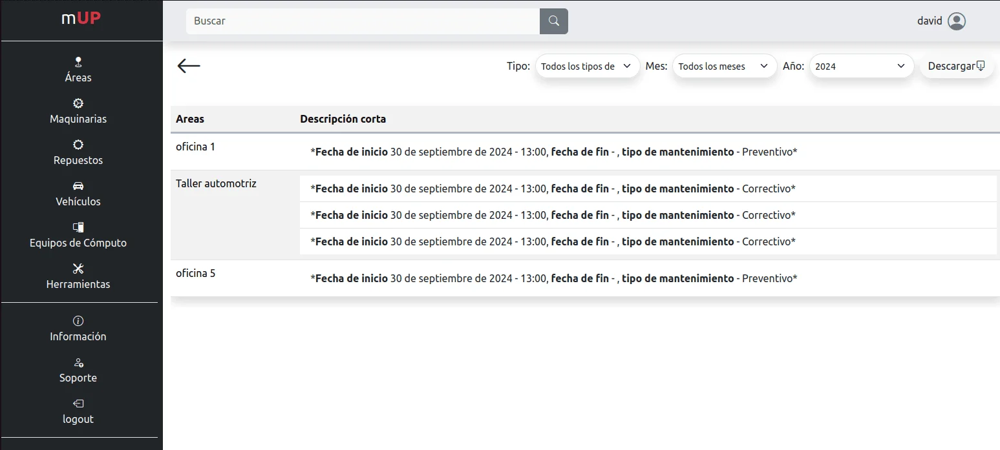
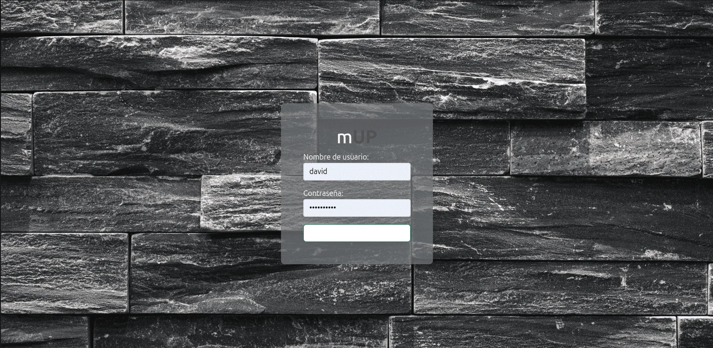

<div align="center">
  
  <h1>mUP - Sistema de Gestión de Mantenimiento</h1>
  <p>
    Una aplicación web integral para la gestión y seguimiento de mantenimientos de activos empresariales como vehículos, maquinaria, equipos de cómputo y más.
  </p>

  <!-- Badges -->
  <p>
    *   **Backend:**
        *   
        *   
    *   **Frontend:**
        *   
        *   
        *   
        *   
    *   **Base de Datos:**
        *    (Desarrollo)
  </p>
</div>

---

## 📖 Contexto del Proyecto

**mUP (Mantenimiento Unificado y Productivo)** fue concebido como una respuesta a los desafíos de gestión en el sector industrial. Desarrollado en estrecha colaboración con **Innovaplast del Ecuador**, el proyecto surge de la necesidad de una solución integral para optimizar sus procesos operativos, permitiendo gestionar de manera eficiente el mantenimiento de maquinaria, vehículos, y otros recursos críticos.

## ✨ Características Principales

- **Dashboard Intuitivo:** Visualización rápida del estado general de los activos y alertas importantes.
- **Arquitectura Modular:** Organiza los datos por categorías como áreas, máquinas, vehículos, equipos de cómputo y herramientas.
- **Alertas Personalizadas:** Sistema de notificaciones en tiempo real con alertas configurables por días, horas o kilómetros, adaptándose a las necesidades de cada activo.
- **Gestión Detallada de Mantenimiento:**
    - Diferencia entre mantenimientos **preventivos** y **correctivos**.
    - Permite adjuntar documentación visual del estado **"antes"** y **"después"** de la intervención.
- **Informes Flexibles:** Genera y descarga registros en formato **Excel** con opciones de filtrado avanzado para facilitar la toma de decisiones.
- **Gestión de Inventario:** Incluye un módulo especializado para la gestión de repuestos y consumibles de almacén.
- **Autenticación Robusta:** Sistema de login que garantiza la seguridad y confidencialidad de la información, restringiendo el acceso al personal autorizado.

## 🛠️ Módulos del Sistema

| Módulo | Descripción |
| :--- | :--- |
| 🚗 **Vehículos** | Gestión de la flota de vehículos, control de mantenimientos, kilometraje y alertas. |
| 🏭 **Máquinas** | Administración de maquinaria industrial, con seguimiento de mantenimientos preventivos y correctivos. |
| 💻 **Equipos de Cómputo** | Inventario y seguimiento de PCs, laptops y servidores, incluyendo sus mantenimientos. |
| 🔧 **Herramientas** | Control de herramientas manuales y eléctricas, su estado y ubicación. |
| 📦 **Repuestos** | Gestión de inventario de repuestos para todos los activos. |
| 🏢 **Áreas** | Administración de las áreas físicas de la empresa y sus necesidades de mantenimiento. |

## 🚀 Tecnologías Utilizadas

| Categoría | Tecnología |
| :--- | :--- |
| **Backend** | Python, Django |
| **Base de Datos** | SQLite (por defecto), PostgreSQL (compatible) |
| **Frontend** | HTML, CSS, JavaScript, Bootstrap |
| **Librerías Python** | Pillow, openpyxl |

## ⚙️ Instalación y Puesta en Marcha

Sigue estos pasos para configurar el entorno de desarrollo local:

**1. Prerrequisitos:**
- Tener instalado [Python 3.10](https://www.python.org/) o superior.
- Tener instalado [Git](https://git-scm.com/).

**2. Clonar el Repositorio:**
```bash
git clone https://github.com/David-Chentes/DJ-mUP.git
cd DJ-mUP
```

**3. Crear y Activar un Entorno Virtual:**
```bash
# Para Linux/macOS
python3 -m venv venv
source venv/bin/activate

# Para Windows
python -m venv venv
.\venv\Scripts\activate
```

**4. Instalar Dependencias:**
```bash
pip install -r requirements.txt
```

**5. Aplicar las Migraciones de la Base de Datos:**
```bash
python manage.py migrate
```

**6. Crear un Superusuario:**
Este usuario tendrá acceso al panel de administración de Django.
```bash
python manage.py createsuperuser
```
Sigue las instrucciones en la terminal para crear tu usuario.

**7. Iniciar el Servidor de Desarrollo:**
```bash
python manage.py runserver
```
La aplicación estará disponible en `http://127.0.0.1:8000/`.

## 🖼️ Galería de la Aplicación

<p align="center">
  
  
</p>
<p align="center">
  
  
</p>
<p align="center">
  
  
</p>
<p align="center">
  
</p>


## 🤝 Contribuciones

Las contribuciones son el corazón del mundo open source. Cualquier aporte que desees hacer será muy bienvenido.

1.  Haz un Fork del proyecto.
2.  Crea tu propia rama (`git checkout -b feature/AmazingFeature`).
3.  Realiza tus cambios (`git commit -m 'Add some AmazingFeature'`).
4.  Sube tus cambios a la rama (`git push origin feature/AmazingFeature`).
5.  Abre un Pull Request.

## 📄 Licencia

Distribuido bajo la Licencia MIT. Se recomienda crear un archivo `LICENSE` en la raíz del proyecto con el contenido de la licencia.

## 📧 Contacto

David Alejandro Chentes Ramos - davidalejandrochentes@gmail.com

Link del Proyecto: [https://github.com/David-Chentes/DJ-mUP](https://github.com/David-Chentes/DJ-mUP)